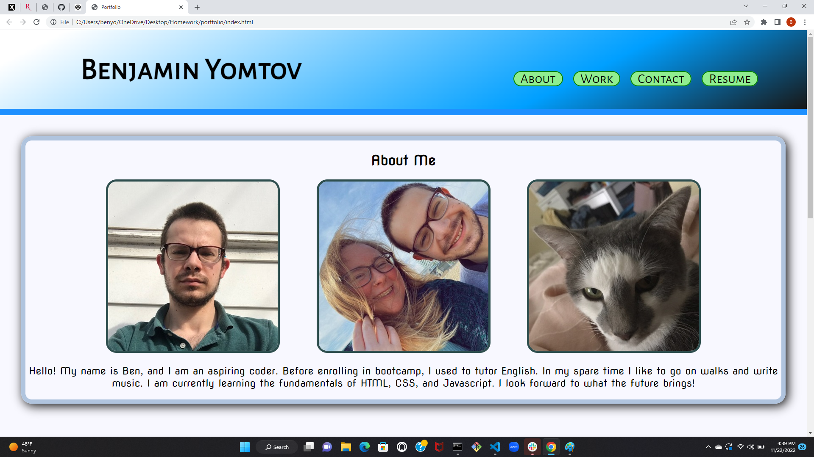
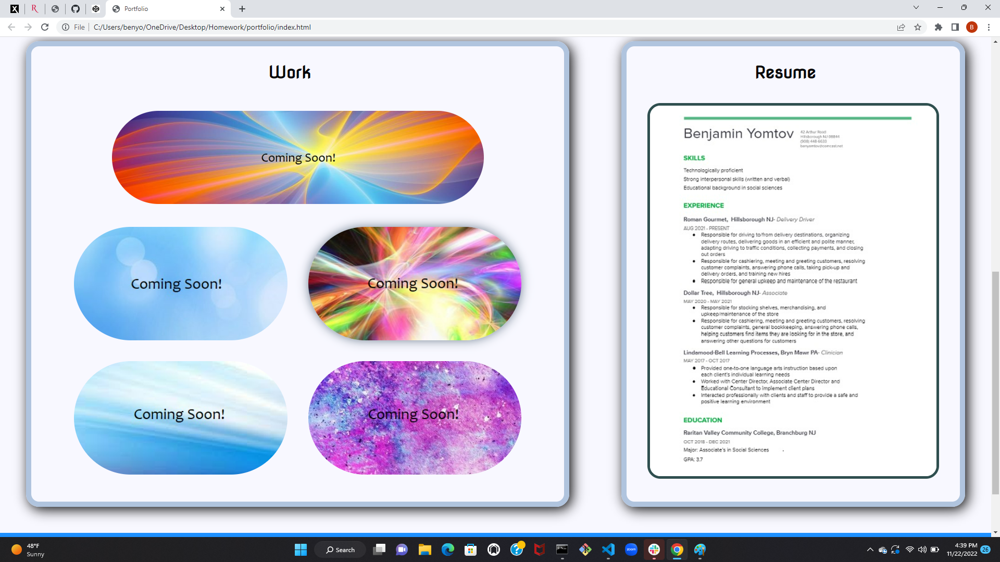
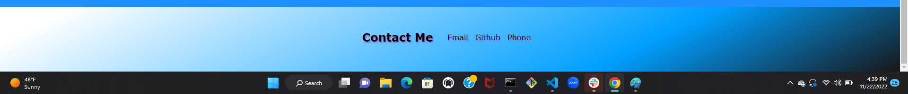
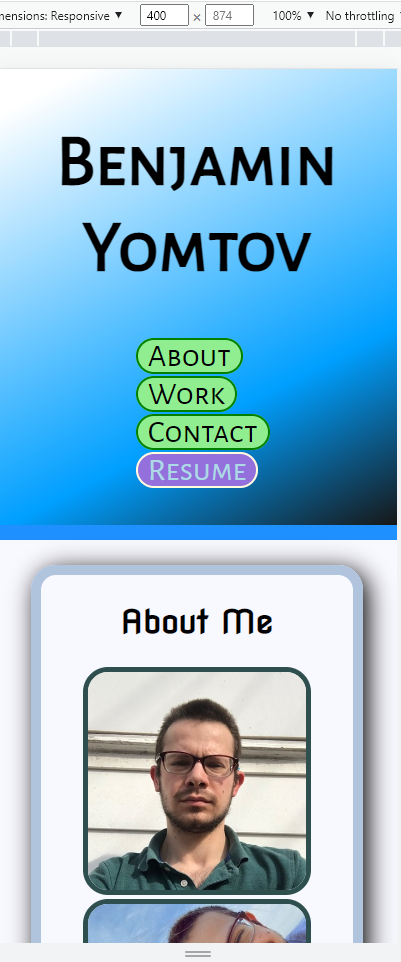
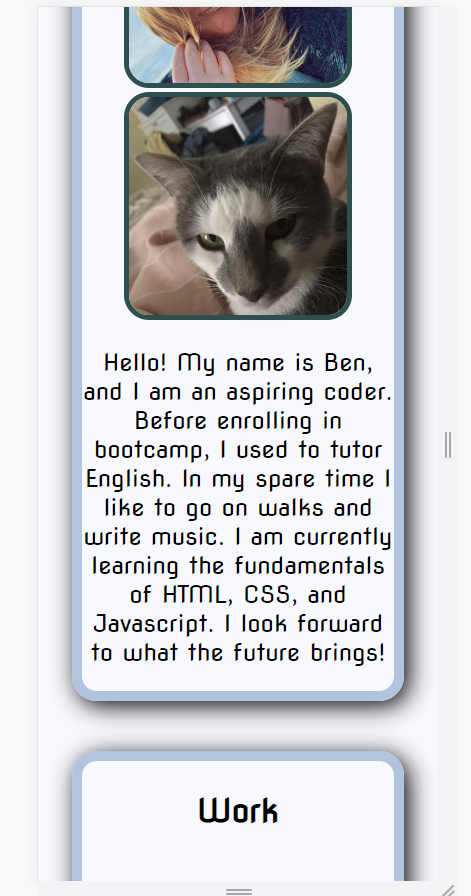
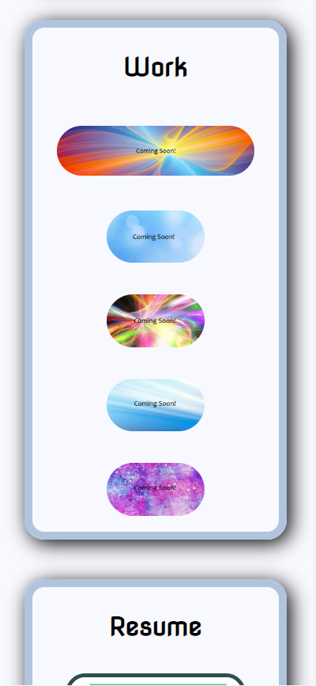
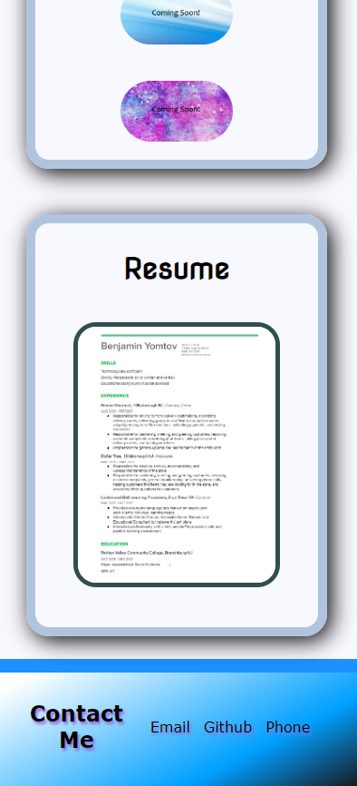

# Portfolio

## Description

Provide a short description explaining the what, why, and how of your project. Use the following questions as a guide:

This portfolio website is designed to showcase my skills as a web developer to potential employers. It has a section about me with pictures, a picture of my resume, a section where I will include links to my work in the future, and a contact me section at the bottom of the page. 

## Installation

The website can be visited at https://benyomtov.github.io/portfolio/.

## Usage

Upon entering the page, the user will see my name at the top of the screen, as well as a navbar with links to the different sections of my website. The "About Me" section has a few pictures and some information about me that the user can read, the work section will have links to that can be accessed by clicking on pictures of the work, a resume section with a picture of my resume, and a "Contact Me" section at the bottom of the screen with links to my phone number, email, and Github. The user can click on these links to contact me. The website is optimized for several different viewport widths.

## Credits

Created by Ben Yomtov.
Fonts were sourced from https://webdesigndev.com/16-gorgeous-web-safe-fonts-to-use-with-css/.
Pictures used as placeholders for project links were sourced from https://www.freewebheaders.com/headers-size-800x200/.

## License
No license.

---
